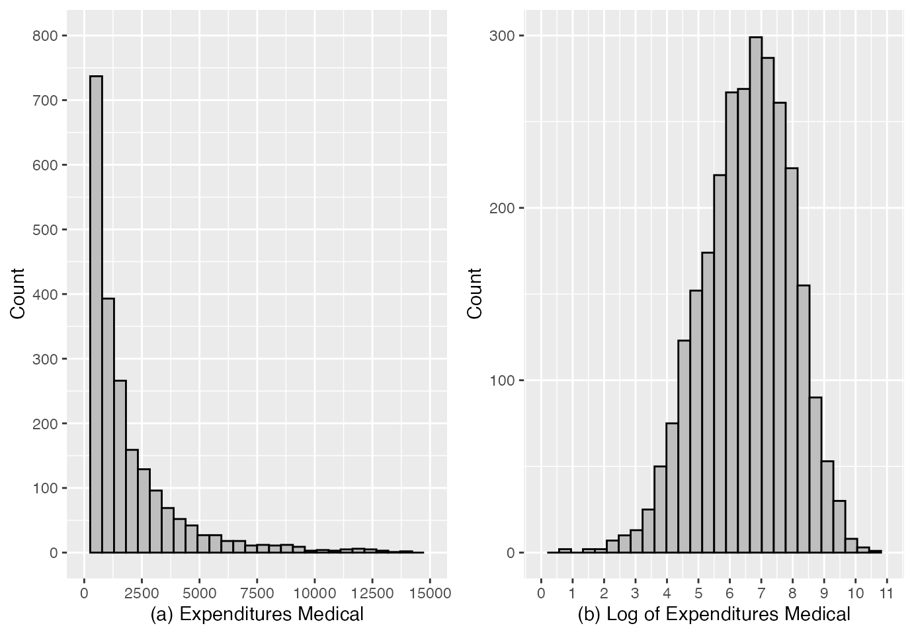

# ssmodels: A package for fit the sample selection models

## Introduction

In order to facilitate the adjustment of the sample selection models
existing in the literature, we created the ssmodels package. Our package
allows the adjustment of the classic Heckman model (Heckman (1976),
Heckman (1979)), and the estimation of the parameters of this model via
the maximum likelihood method and two-step method, in addition to the
adjustment of the Heckman-t models, introduced in the literature by
Marchenko and Genton (2012) and the Heckman-Skew model introduced in the
literature by Ogundimu and Hutton (2016). We also implemented functions
to adjust the generalized version of the Heckman model, introduced by
Bastos et al. (2022), that allows the inclusion of covariables to the
dispersion and correlation parameters and a function to adjust the
Heckman-BS model introduced by Bastos and Barreto-Souza (2020) that uses
the Birnbaum-Saunders distribution as a joint distribution of the
selection and primary regression variables.

## Real Databases

### MEPS 2001

The MEPS is a set of large-scale surveys of families, individuals and
their medical providers (doctors, hospitals, pharmacies, etc.) in the
United States. It has data on the health services Americans use, how
often they use them, the cost of these services and how they are paid,
as well as data on the cost and reach of health insurance available to
American workers. The sample is restricted to persons aged between 21
and 64 years and contains a variable response with 3328 observations of
outpatient costs, of which 526 (15.8%) correspond to unobserved
expenditure values and identified as zero expenditure for adjustment of
the models. It also includes the following explanatory variables:

- educ: education status

- age: Age

- income: income

- female: gender

- vgood: a numeric vector

- good: a numeric vector

- hospexp: a numeric vector

- totchr: number of chronic diseases

- ffs: a numeric vector

- dhospexp: a numeric vector

- age2: a numeric vector

- agefem: a numeric vector

- fairpoor: a numeric vector

- year01: a numeric vector

- instype: a numeric vector

- ambexp: a numeric vector

- lambexp: log ambulatory expenditures

- blhisp: ethnicity

- instype_s1: a numeric vector

- dambexp: dummy variable, ambulatory expenditures

- lnambx: a numeric vector

- ins: insurance status

  These data were also used by Colin and Trivedi (2009), Marchenko and
  Genton (2012) and Zhelonkin et al. (2016) to fit the classical Heckman
  and Heckman-t models and the robust version of the two-step method,
  respectively. We use the variable of interest \$Y\_{1}^{\*}={\rm
  ambexp}\$, which represents expenditure on medical services, on the
  logarithmic scale, since it is highly asymmetric, see [Figura
  1](#fig4). The variable \$Y\_{2}^{\*}={\rm dambexp},\$ representing
  the willingness to spend, is not observed. We observe
  $`U=1\{Y_{2}^{*}>0\},`$ which represents the decision to spend on
  medical care.

``` r

library(ssmodels)
#Leitura do dados MEPS2001
data(MEPS2001)
#tornando visiveis as colunas do data-frame
attach(MEPS2001)
barfill <- "grey"
barlines <- "black"
p1 <- ggplot(MEPS2001,aes(ambexp))+geom_histogram(colour = barlines, fill = barfill)+
  scale_x_continuous(name = "(a) Expenditures Medical",
                     breaks = seq(0, 15000, 2500),
                     limits=c(0, 15000))+
  scale_y_continuous(name = "Count",
                     breaks = seq(0, 800, 100),
                     limits=c(0, 800))
p2 <- ggplot(MEPS2001,aes(lambexp))+geom_histogram(colour = barlines, fill = barfill)+
  scale_x_continuous(name = "(b) Log of Expenditures Medical",
                     breaks = seq(0, 11, 1),
                     limits=c(0, 11))+
  scale_y_continuous(name = "Count",
                     breaks = seq(0, 300, 100),
                     limits=c(0, 300))
gridExtra::grid.arrange(p1, p2, ncol=2)
```



According Marchenko and Genton (2012) and Zhelonkin et al. (2016) it is
natural to fit a sample selection model to such data, since the
willingness to spend $`(Y_{2}^{*})`$ is likely to be related to the
expense amount $`(Y_{1}^{*}).`$ However, after fitting the classic
Heckman model and using the Wald, likelihood ratio, or gradient tests
for $`H_{0}:\rho=0`$ against $`H_{1}:\rho\neq 0,`$ the conclusion is
that there is not sufficient evidence $`(p\textrm{-valor}>0.1)`$ to
reject $`H_{0},`$ that is, there is no bias of selection. Colin and
Trivedi (2009) suspected this conclusion and Marchenko and Genton (2012)
argued that a more robust model could evidence the selection bias
present in the data and rejected the normality hypothesis of the data.
However, we understand that the adjustment of the dispersion and/or the
correlation can be an alternative to study these data without the need
to modify the assumption of normality of the errors, because as our
simulations indicate, the estimations of the parameters obtained by the
adjustment of the model Heckman can be more severely affected by
heteroscedasticity than by incorrect distribution of error terms.

However, due to data asymmetry, we also adjusted the Heckman-BS model.
Thus, we consider the following system of equations for classic and
generalized Heckman models, Heckman-t and Heckman-Skew:

``` math
\begin{align}
lnambx &= \beta_{1}+ \beta_{2}age + \beta_{3}female + \beta_{4}educ + \beta_{5}blhisp + \beta_{6}totchr + \beta_{7}ins + \epsilon_{1i}, \label{eq_reg_aplic1} \\
dambexp&= \gamma_{1}+\gamma_{2}age + \gamma_{3}female + \gamma_{4}educ + \gamma_{5}blhisp + \gamma_{6}totchr + \gamma_{7}ins + \gamma_{8}income + \epsilon_{2i}, \label{eq_sel_aplic1} 
\end{align}
```
where errors are defined for classic Heckman models, Heckman-t and
Heckman-Skew according to
``` math
\begin{align}\label{2:disterro}
\begin{pmatrix}\epsilon_{1i}\\
\epsilon_{2i}
\end{pmatrix} &\overset{ind.}{\sim} \mathcal{N}
\begin{bmatrix}
\begin{pmatrix}
0\\
0
\end{pmatrix}\!\!,&
\begin{pmatrix}
\sigma^{2} & \rho\sigma \\
\sigma\rho & 1
\end{pmatrix}
\end{bmatrix}, i=1,\cdots,n,
\end{align}
```
and for generalized Heckman models how
``` math
\begin{align}\label{2:disterro1}
\begin{pmatrix}\epsilon_{1i}\\
\epsilon_{2i}
\end{pmatrix} &\overset{ind.}{\sim} \mathcal{N}
\begin{bmatrix}
\begin{pmatrix}
0\\
0
\end{pmatrix}\!\!,&
\begin{pmatrix}
\sigma_{i}^{2} & \rho_{i}\sigma_{i} \\
\sigma_{i}\rho_{i} & 1
\end{pmatrix}
\end{bmatrix}, i=1,\cdots,n,
\end{align}
```
in such a way that
``` math
\begin{align*}
\log{(\sigma_{i})} &= \lambda_{1}+\lambda_{2}age + \lambda_{3}female + \lambda_{4}totchr + \lambda_{5}ins\quad \textrm{and}\\ 
\rho_{i}&=\tanh{(\kappa_{0})}, i=1,\cdots, 3328.
\end{align*}
```

To adjust the Heckman-BS model we consider
``` math
\begin{align*}
\log\mu_{1i} &= \beta_{1} + \beta_{2}age + \beta_{3}female  + \beta_{4}educ + \beta_{5}blhisp + \beta_{6}totchr + \beta_{7}ins,\\
\log\mu_{2i} &= \gamma_{1}+\gamma_{2}age + \gamma_{3}female + \gamma_{4}educ + \gamma_{5}blhisp + 
\gamma_{6}totchr + \gamma_{7}ins + \gamma_{8}income,\quad i=1,2,\cdots,3328. 
\end{align*}
```

and $`(ambexp,dambexp)`$ is independently distributed with
Birnbaum-Saunders (BS) Bivariate parameter distribution
$`\mu_{1}>0, \mu_{2}>0, \phi_{1}=\phi>0, \phi_{2}=1`$ and $`-1<\rho<1,`$
that is,
``` math
(ambexp_{i},dambexp_{i})\stackrel{ind}{\sim}\mbox{ BS}(\mu_{1i},\mu_{2i}, 
\phi,1,\rho), \mu_{1i}>0, \mu_{2i}>0, \phi>0\quad \textrm{and}\quad -1<\rho<1, i=1,\cdots, n
```

We observed similar values for the parameters estimated by all models,
mainly the parameters of the variable of interest. However, the only
model that allows a direct interpretation of such parameters is the
Heckman-BS model. We can, for example, affirm, based on the result of
this model, that keeping the other parameters fixed, changing a unit in
age represents an increase of $`24.6\%`$ in ambulatory expenses. For the
other models, the interpretation is related to the log of outpatient
expenses. See the results of the estimates of the parameters below:

``` r

selectEq <- dambexp ~ age + female + educ + blhisp + totchr + ins + income
outcomeEq <- lnambx ~ age + female + educ + blhisp + totchr + ins 
outcomeS <- cbind(age,female,totchr,ins)
outcomeC <- 1
outcomeBS <- ambexp ~ age + female + educ + blhisp + totchr + ins 
mCL <- HeckmanCL(selectEq, outcomeEq, data = MEPS2001)
mBS <- HeckmanBS(selectEq, outcomeBS, data = MEPS2001)
mSK <- HeckmanSK(selectEq, outcomeEq, data = MEPS2001,lambda = 1)
mtS <- HeckmantS(selectEq, outcomeEq, data = MEPS2001,df=12)
mGe <- HeckmanGe(selectEq, outcomeEq,outcomeS, outcomeC, data = MEPS2001)
Parameters <- c("Intercept", "age", "female", "educ", "blhisp", "totchr", "ins", "income",
   "Intercept", "age", "female", "educ", "blhisp", "totchr", "ins", "sigma", "age", "female", "totchr", "ins", "rho", "nu", "lambda")
HBS <- round(mBS$coefficients, digits = 3)
HCL <- round(mCL$coefficients, digits = 3)
HSK <- round(mSK$coefficients, digits = 3)
HtS <- round(mtS$coefficients, digits = 3)
HGe <- round(mGe$coefficients, digits = 3)
Results <- data.frame("Parameters"= Parameters,
                      "HeckmanGe" = c(HGe[1:21], "NA", "NA"), 
                      "HeckmanCL" = c(HCL[1:16], "NA", "NA", "NA", "NA", HCL[17], "NA", "NA"),
                      "HeckmanBS" = c(HBS[1:16], "NA", "NA", "NA", "NA", HBS[17], "NA", "NA"), 
                      "HeckmantS" = c(HtS[1:16], "NA", "NA", "NA", "NA", HtS[17:18], "NA" ),
                      "HeckmanSK" = c(HSK[1:16], "NA", "NA", "NA", "NA", HSK[17], "NA", HSK[18]))
kable(Results, format = "html", align = c("c", "c", "c", "c", "c"))
```

| Parameters | HeckmanGe | HeckmanCL | HeckmanBS | HeckmantS | HeckmanSK |
|:----------:|:---------:|:---------:|:---------:|:---------:|:---------:|
| Intercept  |   -0.59   |  -0.676   |   0.117   |  -0.748   |  -0.657   |
|    age     |   0.094   |   0.088   |   0.09    |   0.099   |   0.088   |
|   female   |   0.632   |   0.663   |   0.722   |   0.725   |   0.661   |
|    educ    |   0.055   |   0.062   |   0.068   |   0.065   |   0.062   |
|   blhisp   |   -0.33   |  -0.364   |  -0.399   |  -0.394   |  -0.363   |
|   totchr   |   0.722   |   0.797   |   0.806   |   0.89    |   0.793   |
|    ins     |   0.165   |   0.17    |   0.179   |   0.18    |   0.17    |
|   income   |   0.002   |   0.003   |   0.003   |   0.003   |   0.003   |
| Intercept  |   5.862   |   5.044   |   5.779   |   5.206   |   4.913   |
|    age     |   0.172   |   0.212   |   0.246   |   0.207   |   0.212   |
|   female   |   0.15    |   0.348   |   0.411   |   0.307   |   0.345   |
|    educ    |   0.001   |   0.019   |  -0.007   |   0.017   |   0.018   |
|   blhisp   |  -0.135   |  -0.219   |  -0.215   |  -0.193   |  -0.216   |
|   totchr   |   0.413   |   0.54    |   0.589   |   0.513   |   0.538   |
|    ins     |  -0.109   |   -0.03   |  -0.061   |  -0.053   |   -0.03   |
|   sigma    |   0.613   |   1.271   |   0.703   |   1.195   |   1.279   |
|    age     |  -0.029   |    NA     |    NA     |    NA     |    NA     |
|   female   |   -0.13   |    NA     |    NA     |    NA     |    NA     |
|   totchr   |  -0.119   |    NA     |    NA     |    NA     |    NA     |
|    ins     |  -0.112   |    NA     |    NA     |    NA     |    NA     |
|    rho     |  -0.742   |  -0.131   |   0.273   |  -0.322   |  -0.137   |
|     nu     |    NA     |    NA     |    NA     |   12.94   |    NA     |
|   lambda   |    NA     |    NA     |    NA     |    NA     |   0.138   |

In addition, there are also the results of the significance of the
parameters. The classic Heckman model adjusted to such data indicates no
correlation between the variables value spent and the decision to spend.
According to Colin and Trivedi (2009), such a result is suspect and
should be better analyzed.

``` r

summary(mCL)
```

    ## 
    ## --------------------------------------------------------------
    ##           Classic Heckman Model (Package: ssmodels)           
    ## --------------------------------------------------------------
    ## --------------------------------------------------------------
    ## Maximum Likelihood estimation 
    ## optim function with method BFGS - iterations number: 62 
    ## Log-Likelihood: -5836.219 
    ## AIC: 11706.44 BIC: 11810.31 
    ## Number of observations: ( 526 censored and 2802 observed ) 
    ## 17 free parameters ( df = 3311 ) 
    ## --------------------------------------------------------------
    ## Probit selection equation:
    ##              Estimate Std. Error t value Pr(>|t|)    
    ## (Intercept) -0.675796   0.194029  -3.483 0.000502 ***
    ## age          0.087907   0.027421   3.206 0.001360 ** 
    ## female       0.662658   0.060937  10.874  < 2e-16 ***
    ## educ         0.061937   0.012029   5.149 2.77e-07 ***
    ## blhisp      -0.363964   0.061874  -5.882 4.45e-09 ***
    ## totchr       0.796956   0.071131  11.204  < 2e-16 ***
    ## ins          0.170143   0.062871   2.706 0.006840 ** 
    ## income       0.002708   0.001316   2.058 0.039677 *  
    ## --------------------------------------------------------------
    ## Outcome equation:
    ##             Estimate Std. Error t value Pr(>|t|)    
    ## (Intercept)  5.04423    0.22812  22.112  < 2e-16 ***
    ## age          0.21196    0.02301   9.213  < 2e-16 ***
    ## female       0.34812    0.06012   5.791 7.65e-09 ***
    ## educ         0.01871    0.01055   1.774 0.076175 .  
    ## blhisp      -0.21858    0.05967  -3.663 0.000253 ***
    ## totchr       0.53992    0.03933  13.727  < 2e-16 ***
    ## ins         -0.02999    0.05109  -0.587 0.557188    
    ## --------------------------------------------------------------
    ## Error terms:
    ##       Estimate Std. Error t value Pr(>|t|)    
    ## sigma  1.27102    0.01838  69.155   <2e-16 ***
    ## rho   -0.13061    0.14709  -0.888    0.375    
    ## ---
    ## Signif. codes:  0 '***' 0.001 '**' 0.01 '*' 0.05 '.' 0.1 ' ' 1
    ## --------------------------------------------------------------

The generalized Heckman model, on the other hand, indicates that there
is the presence of heteroscedasticity in the data and, probably, due to
this, the classic Heckman model is not the most suitable for modeling
these data. Our model, in addition to indicating the presence of
variable dispersion, also indicates a significant correlation between
the variables amount spent and the decision to spend.

``` r

summary(mGe)
```

    ## 
    ## --------------------------------------------------------------
    ##        Generalized Heckman Model (Package: ssmodels)          
    ## --------------------------------------------------------------
    ## --------------------------------------------------------------
    ## Maximum Likelihood estimation 
    ## optim function with method BFGS - iterations number: 38 
    ## Log-Likelihood: -5804.973 
    ## AIC: 11651.95 BIC: 11780.26 
    ## Number of observations: ( 526 censored and 2802 observed )
    ## 21 free parameters ( df = 3307 )
    ## --------------------------------------------------------------
    ## Probit selection equation:
    ##              Estimate Std. Error t value Pr(>|t|)    
    ## (Intercept) -0.589957   0.184520  -3.197 0.001400 ** 
    ## age          0.093819   0.025969   3.613 0.000308 ***
    ## female       0.631683   0.058819  10.739  < 2e-16 ***
    ## educ         0.055192   0.011359   4.859 1.24e-06 ***
    ## blhisp      -0.329958   0.058876  -5.604 2.26e-08 ***
    ## totchr       0.722141   0.068095  10.605  < 2e-16 ***
    ## ins          0.165037   0.060096   2.746 0.006061 ** 
    ## income       0.002378   0.001208   1.968 0.049118 *  
    ## --------------------------------------------------------------
    ## Outcome equation:
    ##               Estimate Std. Error t value Pr(>|t|)    
    ## (Intercept)  5.8619289  0.1932014  30.341  < 2e-16 ***
    ## age          0.1721778  0.0236643   7.276 4.28e-13 ***
    ## female       0.1499038  0.0554250   2.705  0.00687 ** 
    ## educ         0.0009773  0.0101715   0.096  0.92346    
    ## blhisp      -0.1346999  0.0577302  -2.333  0.01969 *  
    ## totchr       0.4131838  0.0285565  14.469  < 2e-16 ***
    ## ins         -0.1090714  0.0513530  -2.124  0.03375 *  
    ## --------------------------------------------------------------
    ## Dispersion terms:
    ##            Estimate Std. Error t value Pr(>|t|)    
    ## interceptS  0.61318    0.06434   9.530  < 2e-16 ***
    ## age        -0.02862    0.01274  -2.247   0.0247 *  
    ## female     -0.12977    0.02849  -4.555 5.44e-06 ***
    ## totchr     -0.11852    0.01849  -6.410 1.66e-10 ***
    ## ins        -0.11225    0.02792  -4.021 5.93e-05 ***
    ## --------------------------------------------------------------
    ## Correlation terms:
    ##             Estimate Std. Error t value Pr(>|t|)    
    ## correlation  -0.6305     0.1024  -6.157  8.3e-10 ***
    ## ---
    ## Signif. codes:  0 '***' 0.001 '**' 0.01 '*' 0.05 '.' 0.1 ' ' 1
    ## --------------------------------------------------------------

On the other hand, as the observed data show asymmetry, the Heckman-BS
model can be a good indication to adjust such data. Note that the
Heckman-BS model also indicates the presence of a significant
correlation. It also presents, as previously mentioned, the advantage of
parsimony and the direct interpretation of the relationship of the
parameters with the response variable of interest.

``` r

summary(mBS)
```

    ## 
    ## --------------------------------------------------------------
    ##    Birnbaum-Saunders Heckman Model (Package: ssmodels)        
    ## --------------------------------------------------------------
    ## --------------------------------------------------------------
    ## Maximum Likelihood estimation 
    ## optim function with method BFGS - iterations number: 91 
    ## Log-Likelihood: -24470.39 
    ## AIC: 48974.79 BIC: 49078.66 
    ## Number of observations: ( 526 censored and 2802 observed ) 
    ## 17 free parameters ( df = 3311 ) 
    ## --------------------------------------------------------------
    ## Probit selection equation:
    ##              Estimate Std. Error t value Pr(>|t|)    
    ## (Intercept)  0.117126   0.235264   0.498   0.6186    
    ## age          0.089529   0.031571   2.836   0.0046 ** 
    ## female       0.721894   0.069037  10.457  < 2e-16 ***
    ## educ         0.068323   0.014689   4.651 3.43e-06 ***
    ## blhisp      -0.398979   0.074350  -5.366 8.59e-08 ***
    ## totchr       0.805603   0.068208  11.811  < 2e-16 ***
    ## ins          0.179313   0.073103   2.453   0.0142 *  
    ## income       0.003424   0.001430   2.394   0.0167 *  
    ## --------------------------------------------------------------
    ## Outcome equation:
    ##              Estimate Std. Error t value Pr(>|t|)    
    ## (Intercept)  5.778625   0.172656  33.469  < 2e-16 ***
    ## age          0.246171   0.022143  11.117  < 2e-16 ***
    ## female       0.410567   0.048235   8.512  < 2e-16 ***
    ## educ        -0.006632   0.009890  -0.671    0.503    
    ## blhisp      -0.215177   0.053171  -4.047 5.31e-05 ***
    ## totchr       0.588729   0.034298  17.165  < 2e-16 ***
    ## ins         -0.061373   0.049609  -1.237    0.216    
    ## --------------------------------------------------------------
    ## Error terms:
    ##       Estimate Std. Error t value Pr(>|t|)    
    ## sigma  0.70282    0.02072   33.92   <2e-16 ***
    ## rho    0.27307    0.11474    2.38   0.0174 *  
    ## ---
    ## Signif. codes:  0 '***' 0.001 '**' 0.01 '*' 0.05 '.' 0.1 ' ' 1
    ## --------------------------------------------------------------

The Heckman-t model, even adjusted to the expense log, indicates the
presence of deviation from normality, since the degree of freedom
parameter is approximately equal to $`13`$ and is significant. Such a
model also observes the significant correlation parameter.

``` r

summary(mtS)
```

    ## 
    ## --------------------------------------------------------------
    ##       t-Student Heckman Model (Package: ssmodels)             
    ## --------------------------------------------------------------
    ## --------------------------------------------------------------
    ## Maximum Likelihood estimation 
    ## optim function with method BFGS - iterations number: 69 
    ## Log-Likelihood: -5822.076 
    ## AIC: 11680.15 BIC: 11790.13 
    ## Number of observations: ( 526 censored and 2802 observed )
    ## 18 free parameters ( df = 3310 )
    ## --------------------------------------------------------------
    ## Probit selection equation:
    ##              Estimate Std. Error t value Pr(>|t|)    
    ## (Intercept) -0.748008   0.207683  -3.602 0.000321 ***
    ## age          0.098537   0.029743   3.313 0.000933 ***
    ## female       0.724814   0.068539  10.575  < 2e-16 ***
    ## educ         0.064845   0.012804   5.064 4.32e-07 ***
    ## blhisp      -0.393546   0.066522  -5.916 3.63e-09 ***
    ## totchr       0.890049   0.087203  10.207  < 2e-16 ***
    ## ins          0.180014   0.068004   2.647 0.008157 ** 
    ## income       0.002978   0.001446   2.059 0.039615 *  
    ## --------------------------------------------------------------
    ## Outcome equation:
    ##             Estimate Std. Error t value Pr(>|t|)    
    ## (Intercept)  5.20585    0.20878  24.935  < 2e-16 ***
    ## age          0.20683    0.02259   9.156  < 2e-16 ***
    ## female       0.30651    0.05623   5.451 5.39e-08 ***
    ## educ         0.01732    0.01025   1.690 0.091096 .  
    ## blhisp      -0.19292    0.05769  -3.344 0.000834 ***
    ## totchr       0.51268    0.03571  14.356  < 2e-16 ***
    ## ins         -0.05251    0.05046  -1.041 0.298168    
    ## --------------------------------------------------------------
    ## Error terms:
    ##       Estimate Std. Error t value Pr(>|t|)    
    ## sigma  1.19492    0.02567  46.541  < 2e-16 ***
    ## rho   -0.32218    0.11454  -2.813  0.00494 ** 
    ## df    12.93970    2.85840   4.527  6.2e-06 ***
    ## ---
    ## Signif. codes:  0 '***' 0.001 '**' 0.01 '*' 0.05 '.' 0.1 ' ' 1
    ## --------------------------------------------------------------

Finally, the Heckman-Skew model also indicates the presence of a
significant correlation between the variables of interest and selection.
In addition, it also indicates deviation from the normality of the
transformed data. It is important to note that without the data
transformation, the iterative method of estimating the parameters of the
Heckman-Skew model does not converge.

``` r

summary(mSK)
```

    ## 
    ## --------------------------------------------------------------
    ##       Skew Normal Heckman Model (Package: ssmodels)           
    ## --------------------------------------------------------------
    ## --------------------------------------------------------------
    ## Maximum Likelihood estimation 
    ## optim function with method BFGS - iterations number: 100 
    ## Log-Likelihood: -5836.325 
    ## AIC: 11708.65 BIC: 11818.63 
    ## Number of observations: ( 526 censored and 2802 observed )
    ## 18 free parameters ( df = 3310 )
    ## --------------------------------------------------------------
    ## Probit selection equation:
    ##              Estimate Std. Error t value Pr(>|t|)    
    ## (Intercept) -0.656938   0.195489  -3.360 0.000787 ***
    ## age          0.088177   0.027423   3.215 0.001315 ** 
    ## female       0.661390   0.060952  10.851  < 2e-16 ***
    ## educ         0.061857   0.012030   5.142 2.88e-07 ***
    ## blhisp      -0.363448   0.061879  -5.873 4.69e-09 ***
    ## totchr       0.792754   0.071024  11.162  < 2e-16 ***
    ## ins          0.169780   0.062882   2.700 0.006969 ** 
    ## income       0.002697   0.001316   2.049 0.040583 *  
    ## --------------------------------------------------------------
    ## Outcome equation:
    ##             Estimate Std. Error t value Pr(>|t|)    
    ## (Intercept)  4.91254    0.29021  16.927  < 2e-16 ***
    ## age          0.21187    0.02304   9.194  < 2e-16 ***
    ## female       0.34518    0.06050   5.706 1.26e-08 ***
    ## educ         0.01838    0.01058   1.737 0.082422 .  
    ## blhisp      -0.21646    0.05984  -3.617 0.000302 ***
    ## totchr       0.53789    0.03958  13.589  < 2e-16 ***
    ## ins         -0.03039    0.05114  -0.594 0.552405    
    ## --------------------------------------------------------------
    ## Error terms:
    ##        Estimate Std. Error t value Pr(>|t|)    
    ## sigma   1.27921    0.02833  45.148   <2e-16 ***
    ## rho    -0.13736    0.15093  -0.910    0.363    
    ## lambda  0.13795    0.18660   0.739    0.460    
    ## ---
    ## Signif. codes:  0 '***' 0.001 '**' 0.01 '*' 0.05 '.' 0.1 ' ' 1
    ## --------------------------------------------------------------

### Nhanes 2003-2004

The US National Health and Nutrition Examination Study (NHANES) is a
survey data collected by the US National Center for Health Statistics.
The survey data dates back to 1999, where individuals of all ages are
interviewed in their home annually and complete the health examination
component of the survey. The study variables include demographic
variables (e.g. age and annual household income), physical measurements
(e.g. BMI – body mass index), health variables (e.g. diabetes status),
and lifestyle variables (e.g. smoking status). This data frame contains
the following columns:

- id: Individual identifier
- age: Age
- gender: Sex 1=male, 0=female
- educ: Education is dichotomized into high school and above versus less
  than high school
- race: categorical variable with five levels
- income: Household income (\$1000 per year) was reported as a range of
  values in dollar (e.g. 0–4999, 5000–9999, etc.)
- and had 10 interval categories. \*Income: Household income (\$1000 per
  year) was reported as a range of values in dollar (e.g. 0–4999,
  5000–9999, etc.)
- and had 10 interval categories.
- bmi: body mass index
- sbp: systolic blood pressure

``` r

library(ssmodels)
data(nhanes)
attach(nhanes)
perc <- function(x,data){
    nna <- ifelse(sum(is.na(x))!=0,summary(x)[[7]],0)
    perc <- ifelse(sum(is.na(x))!=0,(nna/length(data$id))*100,0)
   return(perc)
}
Variables <- c("SBP (mm Hg)", "Age (year)", "Gender", "BMI (Kg/$m^{2}$)", "Education (years)", "Race", "Income ($\\$1000$ per year)", "Numbers Obs.")
perc1 <- round(perc(sbp,nhanes), digits = 2)
perc2 <- round(perc(age,nhanes), digits = 2)
perc3 <- round(perc(gender,nhanes), digits = 2)
perc4 <- round(perc(bmi,nhanes), digits = 2)
perc5 <- round(perc(educ,nhanes), digits = 2)
perc6 <- round(perc(race,nhanes), digits = 2)
perc7 <- round(perc(Income,nhanes), digits = 2)
nObs <- length(Income)
Percentage <- c(perc1, perc2, perc3, perc4, perc5, perc6, perc7, nObs)
df <- subset(nhanes, !is.na(sbp))
df <- subset(df, !is.na(bmi))
attach(df)
perc11 <- round(perc(sbp,df), digits = 2)
perc12 <- round(perc(age,df), digits = 2)
perc13 <- round(perc(gender,df), digits = 2)
perc14 <- round(perc(bmi,df), digits = 2)
perc15 <- round(perc(educ,df), digits = 2)
perc16 <- round(perc(race,df), digits = 2)
perc17 <- round(perc(Income,df), digits = 2)
nObs1 <- length(Income)
Percentage1 <- c(perc11, perc12, perc13, perc14, perc15, perc16, perc17, nObs1)
table <- data.frame("Variables" = Variables, "Percentage of Missing"= Percentage, "Without Missing"= Percentage1)
kable(table, format = "html", align = c("c", "c", "c"))
```

|          Variables           | Percentage.of.Missing | Without.Missing |
|:----------------------------:|:---------------------:|:---------------:|
|         SBP (mm Hg)          |         34.94         |      0.00       |
|          Age (year)          |         0.00          |      0.00       |
|            Gender            |         0.00          |      0.00       |
|      BMI (Kg/$`m^{2}`$)      |         9.91          |      0.00       |
|      Education (years)       |         17.22         |      0.00       |
|             Race             |         0.00          |      0.00       |
| Income ($`\$1000`$ per year) |         24.41         |      25.43      |
|         Numbers Obs.         |        9643.00        |     6193.00     |

``` r

library("gridExtra")
barfill <- "grey"
barlines <- "black"
p1 <- ggplot(df, aes(Income)) + geom_histogram( breaks = seq(0, 10, 0.5), aes(y = ..density..), colour = barlines, fill = barfill)+
  scale_x_continuous(name = "Income",
                   breaks = seq(0, 10, 2),
                   limits=c(0, 10))

p2 <- ggplot(df, aes(log(sbp))) + geom_histogram( colour = barlines, fill = barfill) +
  scale_x_continuous(name = "Log Systolic blood pressure")
grid.arrange(p1, p2, ncol=2)
```


``` r

df$YS <- ifelse(is.na(df$Income),0,1)
df$educ <- ifelse(df$educ<=2,0,1)
df$Income <- ifelse(is.na(df$Income),0,df$Income)
attach(df)
selectionEq <- YS~age+gender+educ+race
outcomeEq   <- log(sbp)~age+gender+educ+bmi+Income
outcomeBS   <- sbp~age+gender+educ+bmi+Income
mCL <- HeckmanCL(selectionEq, outcomeEq, data = df)
mBS <- HeckmanBS(selectionEq, outcomeBS, data = df)
mSK <- HeckmanSK(selectionEq, outcomeEq, data = df, lambda = 0)
mtS <- HeckmantS(selectionEq, outcomeEq, data = df, df = 15)

    Parameters <- c("Intercept", "age", "gender", "educ", "race", "Intercept", "age", "gender", "educ", "bmi", "income", "sigma", "rho", "nu", "lambda")
HBS <- round(mBS$coefficients, digits = 5)
HCL <- round(mCL$coefficients, digits = 5)
HSK <- round(mSK$coefficients, digits = 5)
HtS <- round(mtS$coefficients, digits = 5)
Results <- data.frame("Parameters"= Parameters, 
                      "HeckmanCL" = c(HCL[1:13], "NA", "NA"),
                      "HeckmanBS" = c(HBS[1:13], "NA", "NA"), 
                      "HeckmantS" = c(HtS[1:13], HtS[14], "NA"),
                      "HeckmanSK" = c(HSK[1:13], "NA", HSK[14]))
kable(Results, format = "html", align = c("c", "c", "c", "c", "c"))
```

| Parameters | HeckmanCL | HeckmanBS | HeckmantS | HeckmanSK |
|:----------:|:---------:|:---------:|:---------:|:---------:|
| Intercept  |  0.44002  |  1.35826  |  0.59196  |  0.83716  |
|    age     |  0.01113  |  0.01352  |  0.01031  |  0.01066  |
|   gender   |  0.13623  |  0.15014  |  0.13286  |  0.12093  |
|    educ    | -0.53594  | -0.67408  | -0.59159  | -0.42003  |
|    race    | -0.07011  | -0.09054  | -0.08609  |  -0.0496  |
| Intercept  |  4.51594  |  4.52758  |  4.54001  |  4.63671  |
|    age     |  0.00448  |  0.00448  |  0.00423  |  0.00481  |
|   gender   |  -0.0229  | -0.02341  | -0.02933  | -0.02077  |
|    educ    | -0.04787  | -0.04731  | -0.04199  | -0.05107  |
|    bmi     |  0.00362  |  0.00361  |  0.0037   |  0.00365  |
|   income   |  0.00044  |  0.00039  |  0.00052  |  0.00034  |
|   sigma    |  0.14354  | 96.78292  |  0.11916  |  0.21771  |
|    rho     |  0.77447  |  0.77144  |  0.68082  |  0.90933  |
|     nu     |    NA     |    NA     |  6.97216  |    NA     |
|   lambda   |    NA     |    NA     |    NA     | -1.63051  |

``` r

summary(mCL)
```

    ## 
    ## --------------------------------------------------------------
    ##           Classic Heckman Model (Package: ssmodels)           
    ## --------------------------------------------------------------
    ## --------------------------------------------------------------
    ## Maximum Likelihood estimation 
    ## optim function with method BFGS - iterations number: 72 
    ## Log-Likelihood: -216.546 
    ## AIC: 459.0919 BIC: 546.5972 
    ## Number of observations: ( 1575 censored and 4618 observed ) 
    ## 13 free parameters ( df = 6180 ) 
    ## --------------------------------------------------------------
    ## Probit selection equation:
    ##               Estimate Std. Error t value Pr(>|t|)    
    ## (Intercept)  0.4400250  0.0751788   5.853 5.07e-09 ***
    ## age          0.0111344  0.0008816  12.630  < 2e-16 ***
    ## gender       0.1362320  0.0344494   3.955 7.75e-05 ***
    ## educ        -0.5359430  0.0384988 -13.921  < 2e-16 ***
    ## race        -0.0701079  0.0134076  -5.229 1.76e-07 ***
    ## --------------------------------------------------------------
    ## Outcome equation:
    ##               Estimate Std. Error t value Pr(>|t|)    
    ## (Intercept)  4.516e+00  1.080e-02 418.115  < 2e-16 ***
    ## age          4.477e-03  9.126e-05  49.064  < 2e-16 ***
    ## gender      -2.290e-02  4.027e-03  -5.687 1.35e-08 ***
    ## educ        -4.787e-02  4.864e-03  -9.843  < 2e-16 ***
    ## bmi          3.623e-03  2.905e-04  12.474  < 2e-16 ***
    ## Income       4.369e-04  7.609e-04   0.574    0.566    
    ## --------------------------------------------------------------
    ## Error terms:
    ##       Estimate Std. Error t value Pr(>|t|)    
    ## sigma 0.143540   0.002325   61.74   <2e-16 ***
    ## rho   0.774467   0.022220   34.85   <2e-16 ***
    ## ---
    ## Signif. codes:  0 '***' 0.001 '**' 0.01 '*' 0.05 '.' 0.1 ' ' 1
    ## --------------------------------------------------------------

``` r

summary(mtS)
```

    ## 
    ## --------------------------------------------------------------
    ##       t-Student Heckman Model (Package: ssmodels)             
    ## --------------------------------------------------------------
    ## --------------------------------------------------------------
    ## Maximum Likelihood estimation 
    ## optim function with method BFGS - iterations number: 58 
    ## Log-Likelihood: -160.4791 
    ## AIC: 348.9582 BIC: 443.1946 
    ## Number of observations: ( 1575 censored and 4618 observed )
    ## 14 free parameters ( df = 6179 )
    ## --------------------------------------------------------------
    ## Probit selection equation:
    ##              Estimate Std. Error t value Pr(>|t|)    
    ## (Intercept)  0.591958   0.086278   6.861 7.50e-12 ***
    ## age          0.010313   0.001059   9.734  < 2e-16 ***
    ## gender       0.132856   0.038423   3.458 0.000548 ***
    ## educ        -0.591590   0.043359 -13.644  < 2e-16 ***
    ## race        -0.086086   0.015529  -5.544 3.09e-08 ***
    ## --------------------------------------------------------------
    ## Outcome equation:
    ##               Estimate Std. Error t value Pr(>|t|)    
    ## (Intercept)  4.540e+00  1.065e-02 426.190  < 2e-16 ***
    ## age          4.229e-03  9.285e-05  45.552  < 2e-16 ***
    ## gender      -2.933e-02  3.754e-03  -7.814 6.46e-15 ***
    ## educ        -4.199e-02  4.933e-03  -8.512  < 2e-16 ***
    ## bmi          3.702e-03  2.813e-04  13.160  < 2e-16 ***
    ## Income       5.151e-04  7.317e-04   0.704    0.481    
    ## --------------------------------------------------------------
    ## Error terms:
    ##       Estimate Std. Error t value Pr(>|t|)    
    ## sigma 0.119159   0.003201  37.224   <2e-16 ***
    ## rho   0.680824   0.043463  15.664   <2e-16 ***
    ## df    6.972158   0.783271   8.901   <2e-16 ***
    ## ---
    ## Signif. codes:  0 '***' 0.001 '**' 0.01 '*' 0.05 '.' 0.1 ' ' 1
    ## --------------------------------------------------------------

``` r

summary(mBS)
```

    ## 
    ## --------------------------------------------------------------
    ##    Birnbaum-Saunders Heckman Model (Package: ssmodels)        
    ## --------------------------------------------------------------
    ## --------------------------------------------------------------
    ## Maximum Likelihood estimation 
    ## optim function with method BFGS - iterations number: 74 
    ## Log-Likelihood: -22281.2 
    ## AIC: 44588.39 BIC: 44675.9 
    ## Number of observations: ( 1575 censored and 4618 observed ) 
    ## 13 free parameters ( df = 6180 ) 
    ## --------------------------------------------------------------
    ## Probit selection equation:
    ##              Estimate Std. Error t value Pr(>|t|)    
    ## (Intercept)  1.358262   0.094763  14.333  < 2e-16 ***
    ## age          0.013520   0.001039  13.014  < 2e-16 ***
    ## gender       0.150139   0.043580   3.445 0.000574 ***
    ## educ        -0.674081   0.049313 -13.669  < 2e-16 ***
    ## race        -0.090541   0.016972  -5.335 9.91e-08 ***
    ## --------------------------------------------------------------
    ## Outcome equation:
    ##               Estimate Std. Error t value Pr(>|t|)    
    ## (Intercept)  4.5275845  0.0107230 422.233  < 2e-16 ***
    ## age          0.0044785  0.0000910  49.213  < 2e-16 ***
    ## gender      -0.0234119  0.0040274  -5.813 6.44e-09 ***
    ## educ        -0.0473051  0.0048504  -9.753  < 2e-16 ***
    ## bmi          0.0036104  0.0002907  12.421  < 2e-16 ***
    ## Income       0.0003931  0.0007620   0.516    0.606    
    ## --------------------------------------------------------------
    ## Error terms:
    ##       Estimate Std. Error t value Pr(>|t|)    
    ## sigma 96.78292    3.15870   30.64   <2e-16 ***
    ## rho    0.77144    0.04535   17.01   <2e-16 ***
    ## ---
    ## Signif. codes:  0 '***' 0.001 '**' 0.01 '*' 0.05 '.' 0.1 ' ' 1
    ## --------------------------------------------------------------

``` r

summary(mSK)
```

    ## 
    ## --------------------------------------------------------------
    ##       Skew Normal Heckman Model (Package: ssmodels)           
    ## --------------------------------------------------------------
    ## --------------------------------------------------------------
    ## Maximum Likelihood estimation 
    ## optim function with method BFGS - iterations number: 76 
    ## Log-Likelihood: -202.8192 
    ## AIC: 433.6384 BIC: 527.8748 
    ## Number of observations: ( 1575 censored and 4618 observed )
    ## 14 free parameters ( df = 6179 )
    ## --------------------------------------------------------------
    ## Probit selection equation:
    ##               Estimate Std. Error t value Pr(>|t|)    
    ## (Intercept)  0.8371581  0.0576752  14.515  < 2e-16 ***
    ## age          0.0106596  0.0006877  15.501  < 2e-16 ***
    ## gender       0.1209307  0.0271419   4.456 8.52e-06 ***
    ## educ        -0.4200296  0.0331570 -12.668  < 2e-16 ***
    ## race        -0.0495984  0.0105705  -4.692 2.76e-06 ***
    ## --------------------------------------------------------------
    ## Outcome equation:
    ##               Estimate Std. Error t value Pr(>|t|)    
    ## (Intercept)  4.6367094  0.0122633 378.096  < 2e-16 ***
    ## age          0.0048107  0.0001140  42.206  < 2e-16 ***
    ## gender      -0.0207686  0.0041520  -5.002 5.83e-07 ***
    ## educ        -0.0510660  0.0048686 -10.489  < 2e-16 ***
    ## bmi          0.0036455  0.0002900  12.570  < 2e-16 ***
    ## Income       0.0003416  0.0007569   0.451    0.652    
    ## --------------------------------------------------------------
    ## Error terms:
    ##        Estimate Std. Error t value Pr(>|t|)    
    ## sigma   0.21771    0.01093  19.913   <2e-16 ***
    ## rho     0.90933    0.01493  60.923   <2e-16 ***
    ## lambda -1.63051    0.18338  -8.891   <2e-16 ***
    ## ---
    ## Signif. codes:  0 '***' 0.001 '**' 0.01 '*' 0.05 '.' 0.1 ' ' 1
    ## --------------------------------------------------------------

## References

Bastos, Fernando de Souza, and Wagner Barreto-Souza. 2020.
“Birnbaum–Saunders Sample Selection Model.” *Journal of Applied
Statistics*.

Bastos, Fernando de Souza, Wagner Barreto-Souza, and Marc G Genton.
2022. “A Generalized Heckman Model with Varying Sample Selection Bias
and Dispersion Parameters.” *Statistica Sinica*.

Colin, Cameron A, and Pravin K Trivedi. 2009. “Microeconometrics Using
STATA.” *Lakeway Drive, TX: Stata Press Books*.

Heckman, James J. 1976. “The Common Structure of Statistical Models of
Truncation, Sample Selection and Limited Dependent Variables and a
Simple Estimator for Such Models.” In *Annals of Economic and Social
Measurement, Volume 5, Number 4*. NBER.

Heckman, James J. 1979. “Sample Selection Bias as a Specification
Error.” *Econometrica: Journal of the Econometric Society*, 153–61.

Marchenko, Yulia V, and Marc G Genton. 2012. “A Heckman Selection-t
Model.” *Journal of the American Statistical Association* 107 (497):
304–17.

Ogundimu, Emmanuel O, and Jane L Hutton. 2016. “A Sample Selection Model
with Skew-Normal Distribution.” *Scandinavian Journal of Statistics* 43
(1): 172–90.

Zhelonkin, Mikhail, Marc G Genton, and Elvezio Ronchetti. 2016. “Robust
Inference in Sample Selection Models.” *Journal of the Royal Statistical
Society: Series B (Statistical Methodology)* 78 (4): 805–27.
